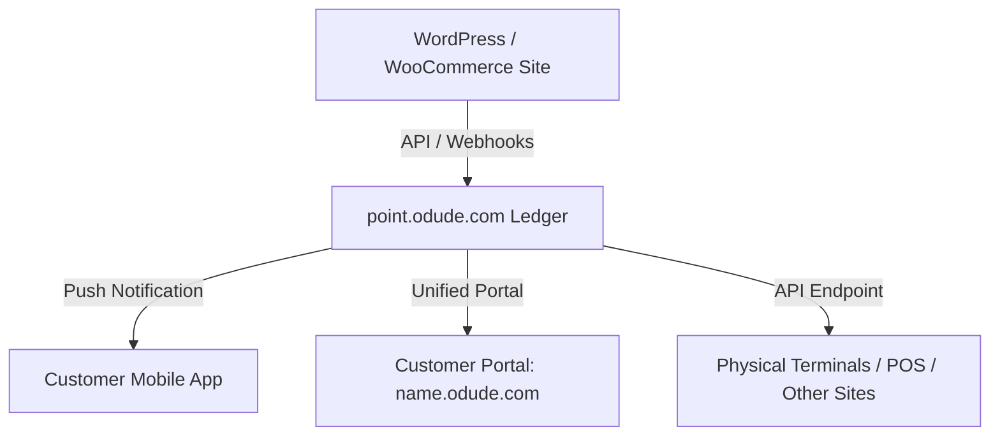

# ODude Reward Point (Loyalty Bridge)

**ODude Reward Point** is a premium WordPress and WooCommerce plugin that bridges your local website with the **ODude Reward Point Universal Loyalty Ledger** ([point.odude.com](https://point.odude.com)). It allows website owners to create a unified, secure, and lightning-fast rewards program.

---

## How It Integrates with point.odude.com

Rather than managing a complex points database on your local WordPress site—which can slow down server performance and isolate customer points to a single website—ODude Reward Point acts as a secure bridge. 

### 1. Centralized & Universal Calculations
All point calculations, user balances, and transactions are offloaded to [point.odude.com](https://point.odude.com). 
* **Universal Loyalty**: Because points are managed centrally, they are not tied to a single WordPress installation. A customer's points are universal across all platforms and terminals connected to the merchant's ODude account.
* **Smart Local Caching**: To prevent performance lag, user balances and transaction history are cached locally in WordPress transients and user metadata, ensuring your site remains lightning fast.

### 2. Multi-Terminal Linking
By utilizing the secure ODude API endpoint, merchants can expand their loyalty network far beyond a single website:
* Link physical brick-and-mortar stores, Point of Sale (POS) registers, mobile apps, or other e-commerce terminals to the same universal points ledger.
* All terminals speak to the same central database, meaning customers can earn points in-store and spend them online (or vice-versa).

### 3. Real-Time Mobile Notifications
Loyalty programs only work when customers are engaged. 
* As soon as a user earns or spends points on your WordPress site, a secure API call is dispatched to [point.odude.com](https://point.odude.com).
* The ledger processes the transaction and immediately triggers a **real-time push notification** to the customer's mobile device.
* Customers can check their balances and transaction histories instantly via the **ODude Mobile App** or their dedicated portal at `name.odude.com`.

---

## Connected Activities & Triggers

The plugin hooks into native WordPress events and WooCommerce flows to automate point distribution and redemption:

### 🛍️ WooCommerce E-Commerce Integration
* **Automated Earning (Webhook-Driven)**: When an order is created (`order.created`), the plugin automatically dispatches order details to the remote API. Points are awarded based on the order value.
* **Checkout Redemption**: Logged-in users can apply their points as monetary discounts on the checkout page. The plugin validates the user's balance, applies limits (e.g. maximum discount percentages or maximum point caps per order), and securely processes the point deduction via the `/redeem` endpoint.
* **Automatic Refund Safeguards**: If a WooCommerce order is refunded or cancelled, the plugin automatically calls the API to restore the customer's redeemed points.

### 🌟 WordPress Core Activity Rewards
Encourage community engagement by rewarding non-purchase activities:
* **Account Registration**: Give users a welcome gift of points immediately upon sign-up.
* **Approved Comments**: Award points when a registered user leaves a blog post comment. Includes daily rate limiting to prevent comment spam.
* **Daily Login Bonus**: Motivate users to return daily by awarding points once per day upon log in.

---

## How to Get Started

1. **Register for an Account**: Sign up at [point.odude.com](https://point.odude.com) to claim your unique **ODude Name** and generate your **Merchant Secret Key** (`op_sk_...`).
2. **Connect the Plugin**: Navigate to the **ODude Reward Point** menu in your WordPress admin panel, insert the API Host Endpoint and your Secret Key, and click **Verify & Connect**.
3. **Configure Rules**: Toggle on WordPress activities and WooCommerce order earning or spending configurations.
4. **Display to Customers**: Use simple shortcodes anywhere on your pages:
   * `[odude_reward_point_balance]` — Renders the current logged-in customer's points balance.
   * `[odude_reward_point_history]` — Renders a clean, responsive transaction ledger.
